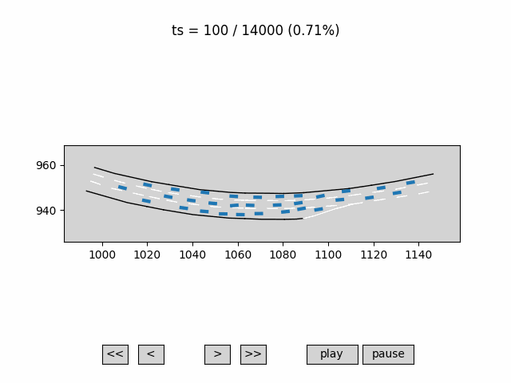
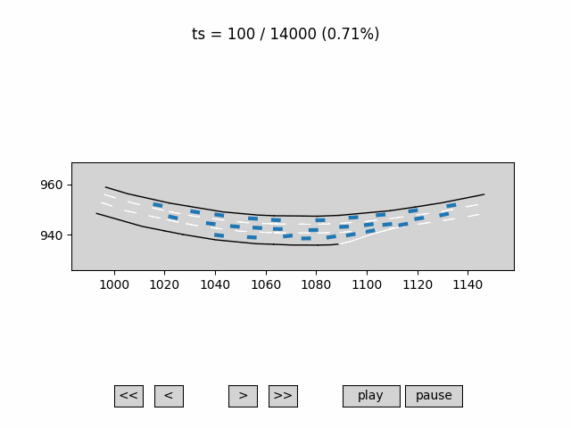
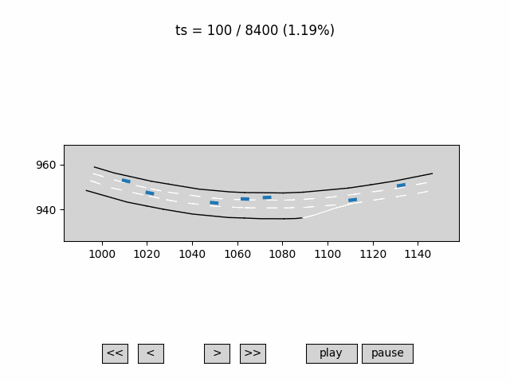
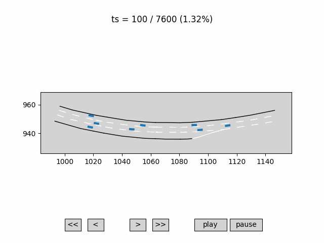

#  SceDiT: Safety-Critical Scenario Generator based on Diffusion in Transformers


---

This work presents a Diffusion Model and Transformers based model, implemented in PyTorch, to generate realistic driving trajectories for training and testing autonomous vehicles.


## 🌟 Features

- **Generation**: Generate any number of vehicles following real-world distributions, with smooth and high-fidelity trajectories.
- **Extension**: Extendable to other scenarios by replacing maps and data.
- **Conditional Safety critical generation)**: Efficiently generate safety-critical scenarios through conditional guidance.
- **Visualization Tools**: Scripts for visualizing generated trajectories
The dataset and visualization tools are from [Interaction Dataset](https://github.com/interaction-dataset/interaction-dataset)


## 🖼️ Visualization

*Generated traffic flows consistent with real-world distributions.*

### Congestion
|  |  |
|:---:|:---:|
### Smooth
|  |  |
|:---:|:---:|


## ⚙️ Environment Setup

Please follow the steps below to set up your development environment. It is recommended to use `conda` to create an isolated virtual environment.

1. **Clone this repository**
    ```bash
    git clone https://github.com/shy19960518/Safety_critical_scenario_generation.git
    cd Safety_critical_scenario_generation
    ```

2.  **Create and activate the Conda environment**
    ```bash
    conda env create -f environment.yaml
    conda activate SceDiT
    ```


## 🚀 Usage Guide

### 1. 数据准备 (Data Preparation)

Download processed torch dataset from [google drive](https://drive.google.com/drive/folders/1q_gv6aD0SijFMi5EBxoOaHjBRuLPNczH?usp=sharing). 

### 2. 模型训练 (Training)

模型的训练过程通过运行 `train.py` 脚本启动，所有参数由配置文件控制。

1.  **配置参数**:
    -   打开 `configs/base_config.yaml` 文件。
    -   修改 `data_path` 指向您准备好的数据集文件。
    -   根据需要调整 `batch_size`, `epochs`, `learning_rate` 以及模型结构等参数。

2.  **开始训练**:
    在终端中运行以下命令：
    ```bash
    python train.py --config configs/base_config.yaml
    ```
    -   训练日志、模型权重 (`.pth` 文件) 和损失曲线图将默认保存在 `experiments/` 目录下，并以时间戳命名。

### 3. 生成轨迹 (Inference / Generation)

当模型训练完成后，您可以使用 `generate.py` 脚本来生成新的轨迹。

-   在终端中运行以下命令，并指定训练好的模型权重路径：
    ```bash
    python generate.py --weights "experiments/YYYY-MM-DD_HH-MM-SS/model_epoch_100.pth" --num_samples 50 --output_path "outputs/generated_trajectories.npy"
    ```
    -   `--weights`: 指定模型权重文件的路径。
    -   `--num_samples`: 指定要生成的轨迹数量。
    -   `--output_path`: 指定生成的轨迹文件的保存路径。

### 4. 结果可视化 (Visualization)

我们提供了一个脚本来可视化生成的轨迹，以便直观地评估其质量。

-   运行 `visualize.py` 并指定轨迹文件路径：
    ```bash
    # 可视化生成的轨迹
    python visualize.py --data_path "outputs/generated_trajectories.npy"

    # (可选) 同时可视化真实轨迹以作对比
    python visualize.py --data_path "outputs/generated_trajectories.npy" --ground_truth_path "data/train_trajectories.npy"
    ```
    -   生成的轨迹图将保存在 `outputs/` 目录下。

## 🏗️ 项目结构 (Project Structure)
