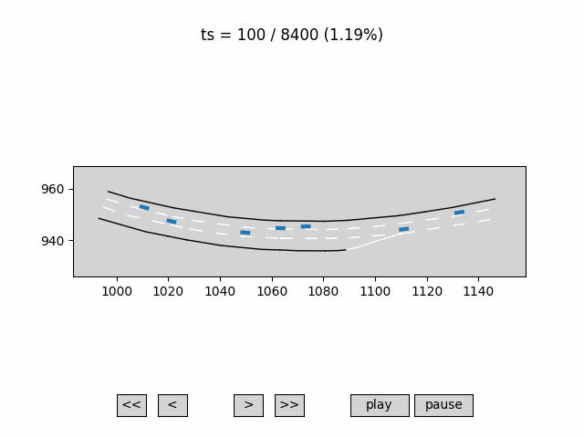
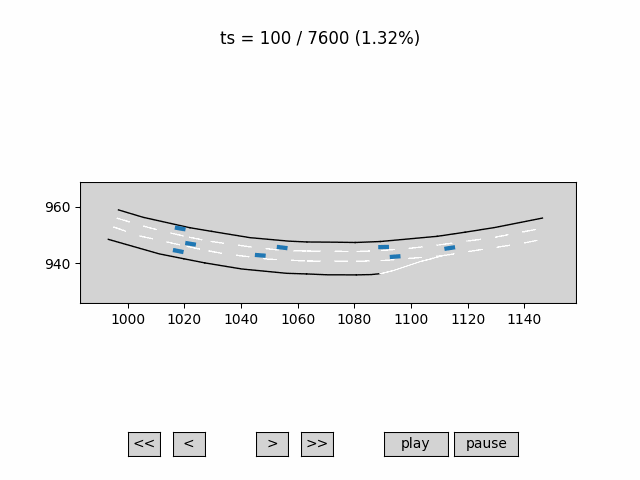
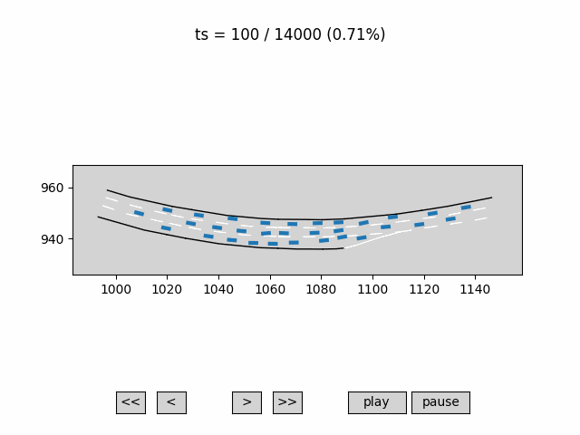
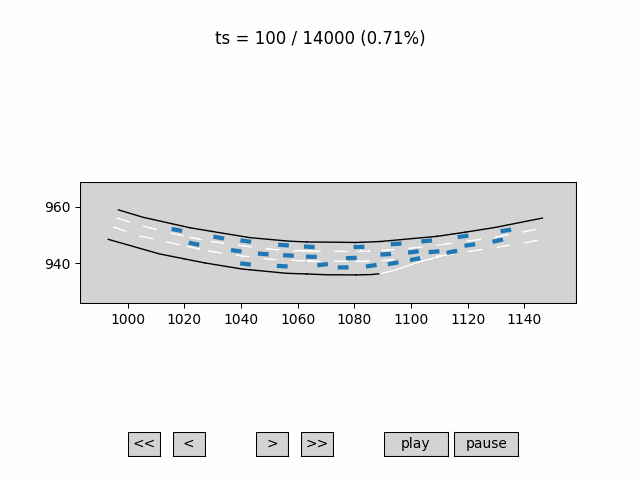

# Safety_critical_scenario_generation
Safety_critical_scenario_generation with diffusion in transformer using pytorch

> ⚠️ This project is currently under development.  
> The code is not fully organized or finalized yet.  
> Some parts of the implementation are experimental.

## 📌 Disclaimer

This repository may contain code partially inspired by or adapted from other open-source projects.  
Full credit and acknowledgements will be added once the code structure is finalized.  
If you see any uncredited content that belongs to you or someone else, please feel free to contact me.

📂 Dataset

The dataset used in this project is available at:  
➡️ [yourproject-dataset](https://github.com/yourusername/yourproject-dataset)

Visualisation Results

